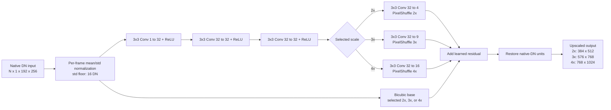
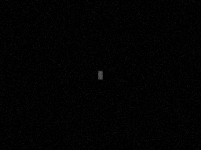
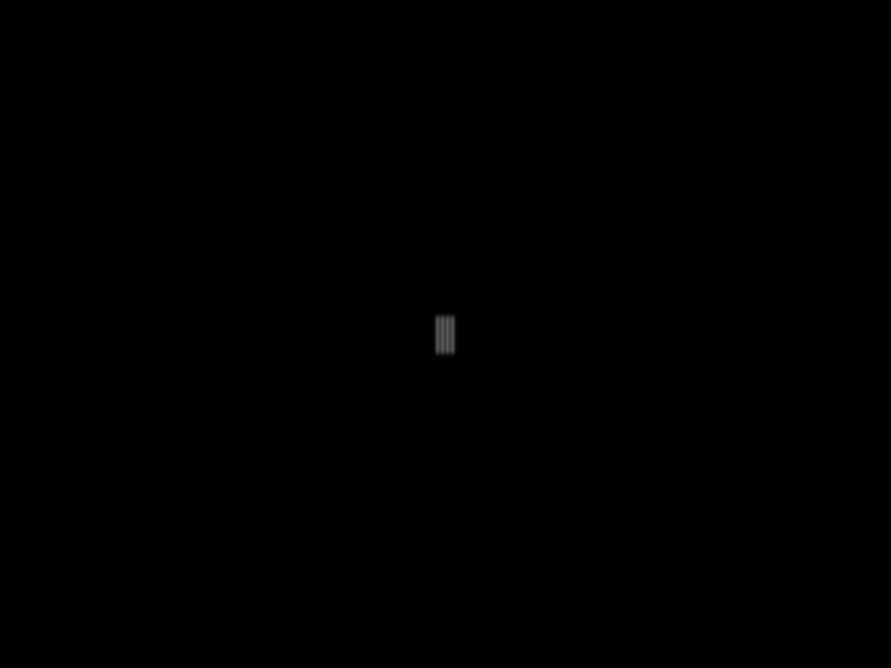
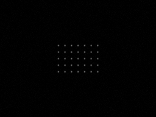
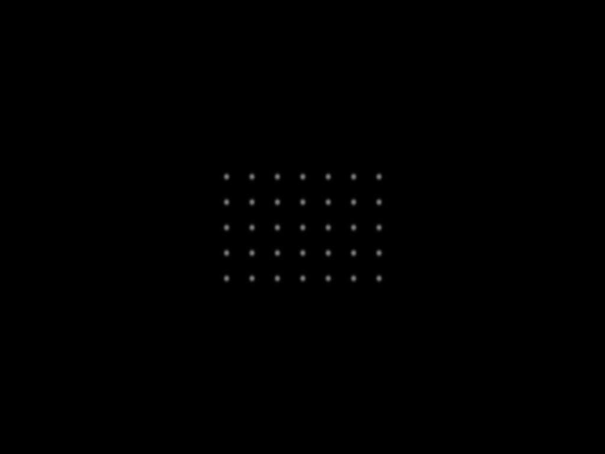
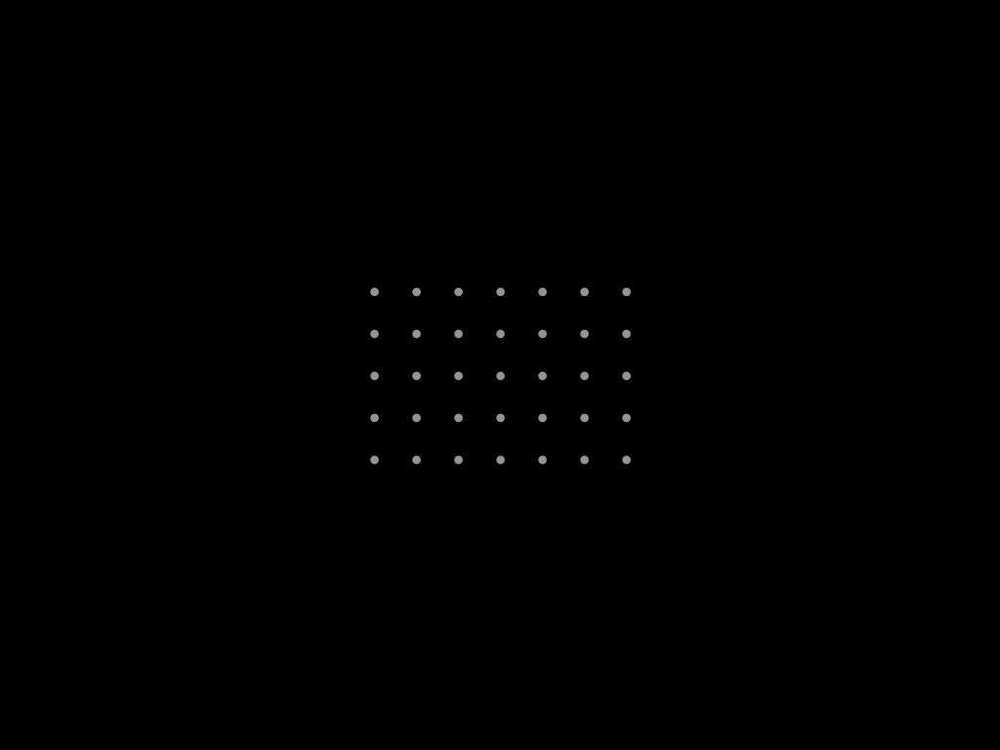
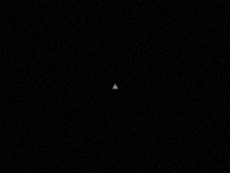
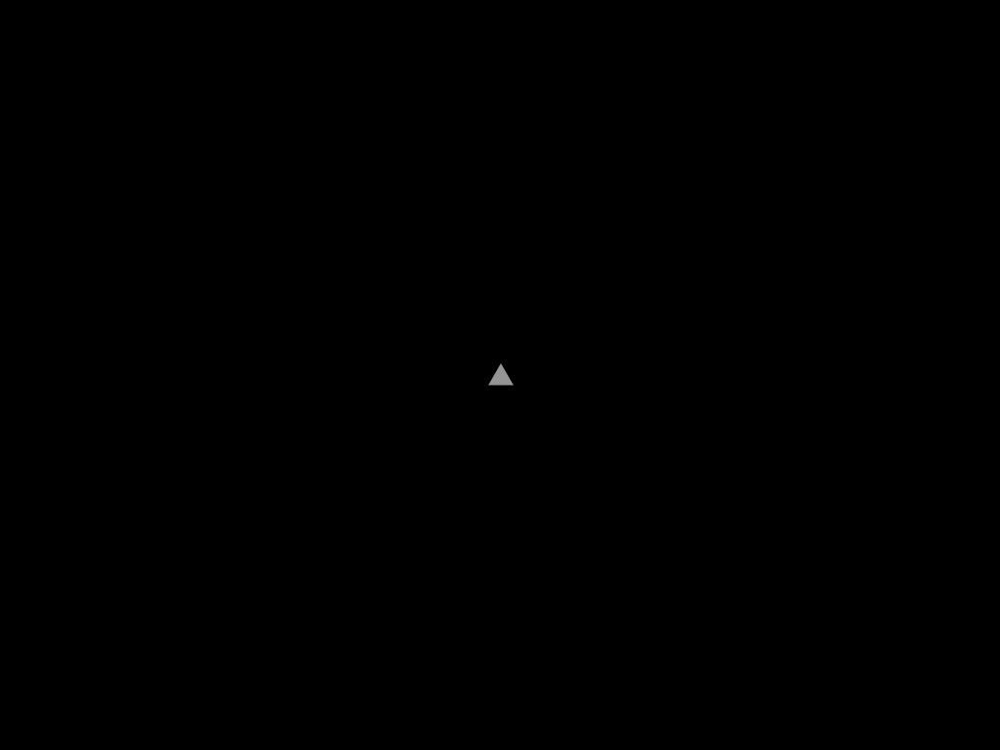

# P3-Thermal

Local-first tooling for the Thermal Master P3 camera: a qualified native-frame
viewer/recorder, a synthetic calibration dataset generator, and an isolated GPU
upscaling environment.

## Projects

| Directory | Purpose |
| --- | --- |
| `p3thermal/` | P3 USB transport, protocol decoding, immutable native-frame recording, replay, and local browser viewer. |
| `thermal-calibration-lab/` | Reproducible synthetic physical-target sequences with native 256x192 observations and 2x/3x/4x simulator references. |
| `p3thermal-upscaling/` | Dedicated CUDA/PyTorch training, TorchScript export, and loopback-only learned-preview sidecar. |

Read `P3_Thermal_Software_Plan.md` for the architecture and acceptance gates,
and `PROGRESS.md` for verified evidence, known limits, and the current ordered
work. Each project has its own setup and usage instructions in its README.

## Upscaler Architecture

The exported model normalizes each native-DN frame, predicts a learned residual
over bicubic interpolation, then restores native-DN units. One shared 32-channel
feature trunk supports all currently generated scales.



## Boundaries

- Run P3 USB operations only from native Windows using the camera project's
  Windows virtual environment. Do not use USB/IP or WSL for camera access.
- Keep PyTorch and CUDA out of the qualified camera environment. Learned
  previews use a loopback-only sidecar from `p3thermal-upscaling`.
- Native recordings and `/api/frame` data remain raw immutable `uint16` camera
  frames. Learned images are derived previews only.
- The current synthetic contract contains 2x, 3x, and 4x references only.
  Synthetic data is an assumed-camera model, not physical P3 calibration or
  real-scene super-resolution evidence.

## Run Learned Preview

Run these commands in separate native Windows PowerShell windows. Do not run P3
USB access through WSL.

Start the Torch-owning GPU sidecar:

```powershell
cd C:\Users\athan\thermal\p3thermal-upscaling
.\.venv\Scripts\python.exe -m p3thermal_upscaling.serve `
  --artifact artifacts\p3-upscaler-starter-baseline.ts --port 8766
```

Then start the camera viewer connected to that sidecar:

```powershell
cd C:\Users\athan\thermal\p3thermal
.\.venv-windows\Scripts\python.exe -m p3thermal.cli serve `
  --inference-url http://127.0.0.1:8766
```

Open `http://127.0.0.1:8765` and select Learned 2x, Learned 3x, or Learned 4x.
The bundled artifact is a starter-corpus synthetic baseline, not a real-P3
super-resolution quality claim. See the project READMEs for setup, replay, and
qualification details.

## Examples

The local viewer can compare native capture and learned previews while retaining
independent zoom and histogram controls.


The calibration lab supplies known synthetic references for controlled pipeline
development. This representative four-bars sequence has a 256x192 observation
and two distinct 4x (1024x768) simulator targets:

| Observed native frame | Acquisition-space 4x reference | Instantaneous ideal 4x reference |
| --- | --- | --- |
|  |  |  |

The fiducial-grid view provides a repeatable multi-feature calibration target:

| Observed native frame | Acquisition-space 4x reference | Instantaneous ideal 4x reference |
| --- | --- | --- |
|  |  |  |

The occlusion challenge adds a foreground occluder to test robustness under a
declared nuisance condition:

| Observed native frame | Acquisition-space 4x reference | Instantaneous ideal 4x reference |
| --- | --- | --- |
|  |  |  |

These are assumed-camera simulator outputs, not P3 measurements or real-scene
super-resolution evidence. See `assets/README.md` for asset provenance.

## Repository Hygiene

Virtual environments, generated datasets, recordings, training runs, exported
weights, logs, and caches are intentionally ignored. Recreate them from the
documented commands rather than committing them.
